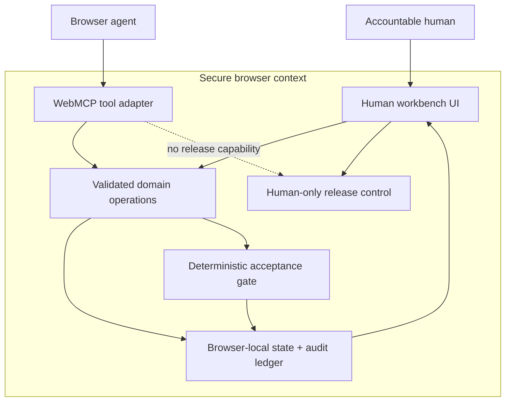

# Implemented architecture

WEXSPACE ProofDesk has one shared domain layer. Human controls and WebMCP tools do not maintain parallel business logic or hidden state.

## Boundary table

| Boundary | Implemented behavior |
|---|---|
| Human input | Visible forms define intent, evidence, and review decisions. |
| Agent input | Five narrow WebMCP tools with JSON Schema inputs. |
| Shared execution | Both paths call `lib/proofdesk/domain.ts`. |
| Deterministic check | Required criteria are covered only by medium/high evidence. |
| Persistence | Versioned workspace is stored in browser `localStorage`. |
| Audit | Every material state transition records actor, time, action, and detail. |
| Release | Approval/rejection is available only in the human interface. |
| Unsupported browser | Human UI continues; capability status truthfully reports WebMCP unavailable. |

No backend AI service, hidden remote database, or autonomous release system is represented as implemented in this competition branch.
