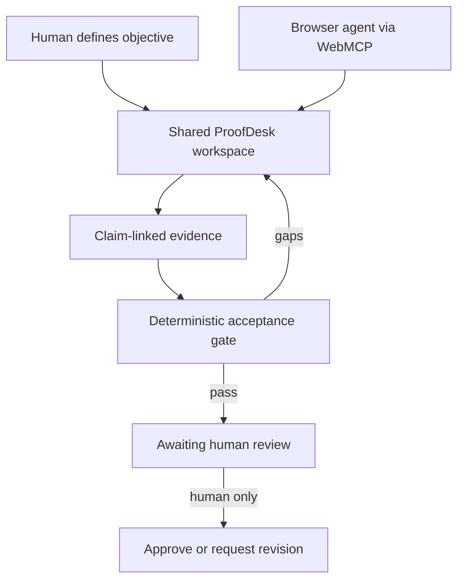

# WEXSPACE ProofDesk

WEXSPACE ProofDesk is a real WebMCP-powered workbench where a human and a browser agent collaborate on the same bounded evidence package. The agent can create a work item, add claim-linked evidence, run a deterministic acceptance gate, and prepare review. Only the human interface can approve or reject release.

This repository is the competition-period implementation for **The WebMCP Challenge**. It is a new, isolated WEXSPACE extension; it does not claim that earlier WEXSPACE or IEW work was created during this challenge.

## Live judge access

- **Working application:** https://wexspace-proofdesk.moatazalqobati20.chatgpt.site/
- **Competition source branch:** https://github.com/moatazfarea/wexspace-iew-agentic-fleet/tree/webmcp-challenge-2026
- **Deployed runtime source:** public GitHub commit [`561df8f5bcfc40262af27706e0cc620878b738db`](https://github.com/moatazfarea/wexspace-iew-agentic-fleet/commit/561df8f5bcfc40262af27706e0cc620878b738db), tree `c036a166e9eaa2d986e55213d7522ce14b9fadfd`

The site is public and requires no account. For native tool discovery, open it in the ChatGPT desktop in-app browser or Chrome 149+ with WebMCP testing enabled.

## What works

- A human-first working interface for deliverable contracts, evidence, acceptance checks, audit history, and release review.
- Five imperative WebMCP tools registered with `document.modelContext.registerTool`.
- Shared domain operations: the human UI and WebMCP tools execute the same validated functions.
- Deterministic evidence-coverage scoring; model arithmetic is not used.
- Browser-local persistence and reload recovery.
- A visible, machine-verifiable `AWAITING_HUMAN_REVIEW` boundary.
- Human-only final release; no site tool exposes approval or release.
- Graceful fallback: the human application remains functional when WebMCP is unavailable.

## Human–agent workflow



## WebMCP tools

| Tool | Effect | Purpose |
|---|---|---|
| `wexspace.inspect_workspace` | Read-only | Read current status, coverage, release state, and permitted next actions. |
| `wexspace.create_work_item` | Mutating | Create or replace the bounded work item with 2–6 acceptance criteria. |
| `wexspace.add_evidence` | Mutating | Add one HTTPS source mapped to one criterion. |
| `wexspace.run_acceptance_gate` | Mutating, deterministic | Recompute required-criterion evidence coverage. |
| `wexspace.prepare_human_review` | Mutating | Queue a passing package for human review without releasing it. |

Tool descriptions state their side effects. Input schemas reject extra properties and constrain lengths. Evidence content is marked untrusted. The read-only inspection tool is annotated accordingly.

## Run locally

Requirements:

- Node.js 22.13 or newer
- npm

```bash
npm ci
npm run dev
```

Open the local URL printed by the development server. The visual application works in a normal modern browser. Native site-tool discovery additionally requires a current WebMCP-capable secure browser environment, such as a supported ChatGPT desktop built-in browser or a compatible Chrome build configured for WebMCP.

## Two-minute judge path

1. Open the [public application](https://wexspace-proofdesk.moatazalqobati20.chatgpt.site/) in a WebMCP-capable browser.
2. Inspect the five `wexspace.*` tools.
3. Create one work item with 2–6 required acceptance criteria.
4. Add one medium- or high-confidence HTTPS evidence item for each criterion.
5. Run `wexspace.run_acceptance_gate`; the score is computed deterministically from criterion coverage.
6. Run `wexspace.prepare_human_review` and confirm that both the visible UI and the tool response reach `AWAITING_HUMAN_REVIEW` with `releasePerformed: false`.
7. Confirm that no WebMCP tool can approve or release the package; that authority remains in the human interface.

A public-path execution completed this sequence with five discovered tools, three evidence mutations, a 100% gate score, and an unreleased human-review state. The machine-readable record is in [`evidence/PUBLIC_JUDGE_PATH_R01.json`](evidence/PUBLIC_JUDGE_PATH_R01.json).

## Verify

```bash
npm test
npm run lint
```

The test suite covers:

- deterministic pass/fail coverage behavior;
- the full work-item → evidence → gate → human-review state sequence;
- human-only release;
- exact registration of five scoped WebMCP tools;
- the absence of any agent release tool;
- schema strictness and read-only annotations;
- graceful WebMCP-unavailable behavior;
- production rendering of the real workbench.

## Implemented architecture

- `app/workbench.tsx` — visible shared-control workspace and browser persistence.
- `lib/proofdesk/domain.ts` — framework-independent validation and deterministic state transitions.
- `lib/proofdesk/webmcp.ts` — WebMCP tool catalog and registration.
- `tests/proofdesk-domain.test.mjs` — domain and WebMCP contract tests.
- `evidence/` — machine-readable competition evidence and provenance.

See [ARCHITECTURE.md](ARCHITECTURE.md) for the implemented boundary map and [PROVENANCE.md](PROVENANCE.md) for the prior/new-work split.

## Security and human control

- No credentials, API keys, cookies, or remote account data are requested or stored.
- Workspace state stays in browser `localStorage`; the application has no cloud sync in this release.
- Only HTTPS evidence URLs are accepted.
- Low-confidence evidence does not satisfy the acceptance gate.
- Tool parameters are deliberately narrow to reduce context leakage.
- Agent tools can prepare, but cannot approve or release, a package.
- Released work becomes immutable in the active workspace.

See [SECURITY.md](SECURITY.md) for the threat model and current limitations.

## Prior work and competition-new work

Pre-existing: the WEXSPACE product identity and its general governance ideas, plus an unrelated historical WEXSPACE/IEW competition implementation.

Created for this challenge: this ProofDesk application, its WebMCP tools, UI, domain engine, tests, deployment, documentation, demo, and evidence package. No historical engineering artifact is presented as newly generated here.

## Limitations

- This release manages one active package per browser profile.
- Evidence quality is declared by the human or agent and is not independently fact-checked by the app.
- Browser-local persistence is device-specific and can be cleared by the user.
- WebMCP is an evolving draft; native discovery depends on browser support.
- ProofDesk is a governance and evidence workflow, not a professional certification authority.

## License

MIT. See [LICENSE](LICENSE).
